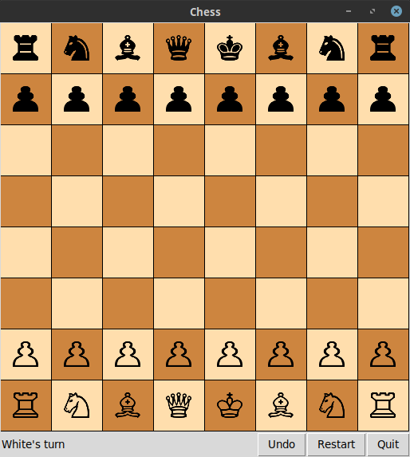

# chess

## Prerequisites
In order to run the game you need to install some dependencies:
```bash
sudo pip3 install virtualenv pillow
```
## Quickstart
#### First
To start the game, first create a virtual environment and activate it:
```bash
virtualenv venv
source ./venv/bin/activate
```
And then run the following command in the virtual environement:
```bash
pip install -r requirements.txt
```
#### Second
Then you are able to run the game using the following command:
```bash
python main.py
```
## Patterns Explanation
For each pattern (mentioned below) there is a module of the same name, that corresponds to that of the [Gang of four](https://www.amazon.com/Design-Patterns-Object-Oriented-Addison-Wesley-Professional-ebook/dp/B000SEIBB8) published book:
##### [Singleton](singleton.py)
In this pattern, the purpose was to have a single board item, representing the whole [Board](board.py#L7) object; and it is used in the [main](main.py#L7) module:
```python
from singleton import Singleton
chess = Singleton().chess
```

##### [Flyweight](flyweight.py)
This module's purpose was to have all the [pieces](piece.py) initialized and have it used on demand like so in the [board](board.py#L72) module:
```python
from flyweight import PieceCreator
abbr2piece = PieceCreator()
piece = abbr2piece(letter)

```

##### [Factory](factory.py)
This one's pretty obvious, it is implementing factory pattern to create a new instance of each [piece](piece.py) when the [flyweight](README.md#Flyweight) requires it in it's [module](flyweight.py#L5) like so:
```python
from factory import PieceFactory
# alias for convenience
factory = PieceFactory.factory
self.white_pawns = [factory('pawn', 'white') for _ in range(8)]
self.white_rooks = [factory('rook', 'white') for _ in range(2)]
self.white_knights = [factory('knight', 'white') for _ in range(2)]
self.white_bishops = [factory('bishop', 'white') for _ in range(2)]
self.white_queen = factory('queen', 'white')
self.white_king = factory('king', 'white')
```

##### [Memento](memento.py)
This module is responsible for keeping the history and also it's **undo** process and it's used in the [chess](chess.py#L87:L98) module:
```python
def undo(self):
    last_memento = self._care_taker.pop()
    self.set_memento(last_memento)

def set_memento(self, memento):
    previous_state = pickle.loads(memento).get_state()
    vars(self).clear()
    vars(self).update(previous_state)

def create_memento(self):
    memento = Memento(vars(self))
    return pickle.dumps(memento)

```

##### [Command](command.py)
Finally this module is responsible for invoking the right receiver (only used for **undo** process); and it's used in the [gui](gui.py#L211) module:
```python
command = ConcreteCommand(self.chess.undo)
self._invoker.store_command(command)
self._invoker.execute_commands()

```
